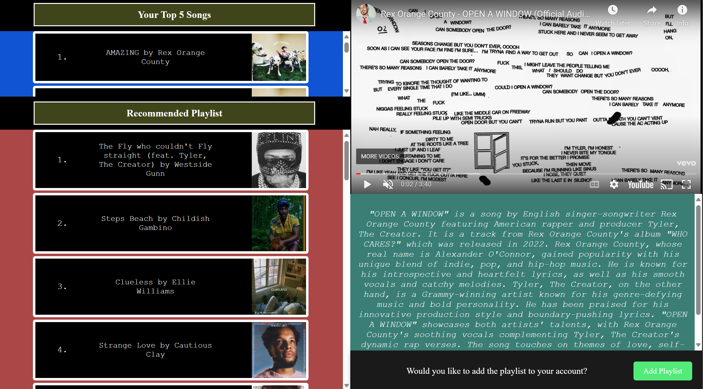

# Overview
This project consists of a Flask backend and a React frontend for creating and managing Spotify playlists. This project integrates with the Spotify, OpenAI, and YouTube APIs to create a suggested playlist based on the user's top 5 listened songs. It provides detailed descriptions from ChatGPT for each song and includes a YouTube video associated with it. Follow the instructions below to set up and run the application.

# Project Structure 
- Backend (Flask): Handles API requests, processes Spotify data, communicates with OpenAI and YouTube APIs.
- Frontend (React): Provides the user interface, handles user authentication, and displays playlists and song details.

# Features
- Spotify Integration: Fetches user's top 5 listened songs and creates a playlist based on those songs.
- OpenAI Integration: Provides detailed song descriptions using ChatGPT.
- YouTube Integration: Retrieves a YouTube video for each song.
- React Router: Manages navigation between pages in the React frontend.

# Prerequisites
- Python 3.x
- Node.js and npm
- Virtualenv (for Python virtual environment)

# Setup Instructions
1. 
Clone the Repository
```bash
https://github.com/carlos-22-chasi/Spotify-Playlist-Recommender.git
cd Spotify-Playlist-Recommender
```

2. Create a .env file with the following content 
```bash
SECRET_KEY=your_secret_key
```
3. SetUp the Backend
   
3.1 Navigate to the Backend Directory
```bash 
cd flask-backend
```
3.2 Create and Activate a Virtual Environment
```bash 
# Create the virtual environment
python -m venv venv

# Activate the virtual environment
# On macOS/Linux
source venv/bin/activate

# On Windows
.\venv\Scripts\activate
```
3.3 Install Python Dependencies
```bash
pip install -r requirements.txt
```
3.4 Run the Flask Development Server
```bash
python server.py
```
This will start the Flask backend server at http://127.0.0.1:5000/

4. Set Up the Front End
   
4.1 Navigate to the Frontend Directory
In a seperate termial run 
```bash
cd react-front-end
```
4.2 Install Node.js Dependencies
```bash
npm install
```
4.3 Run the React Development Server
```bash
npm start
```
This will start the React development server at http://localhost:3000/ 

The react server should automatically open the Welcome Page. In the Welcome Page it will ask for information in order to continue. Just fill in the form and you will be able to proceed with the application. Once eveything is complete it should bring you to a webpage that looks like this: 



# Usage

- Display a Song's Video and Details: Click on any song to watch the music video associated with it from YouTube and read informtaion about the song fetched from OpenAI
- Add Recommended Playlist to your account: Click on the "Add Playlist" button to add the song playlist to your account. It will prompt the user to add a name to the playlist and submit. This will add all the songs from the recommended playlist to your account under that playlist name. 